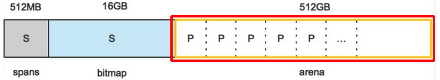
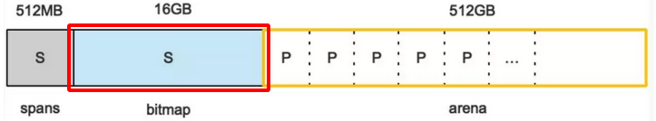

# Memory management mspan

The basic components of Golang’s memory allocation are `mcache, mcentral, and mheap`. The basic unit of Go memory management is the `mspan`.

## Memory Request Allocation

### Introduction

When a Go program starts, it asks the operating system for some memory.

It then divides this memory into smaller parts and manages it on its own.

On an`X64` system, the memory is divided into three areas of `512MB, 16GB, and 512GB`.

### heap arena

 

Go divides `heap arena` into small parts called `8KB pages`.

Some `8KB pages` are grouped together and called an `mspan`(多个 8K 页面，会组成 mspan)

(2023/4/12)

### bitmap

 

