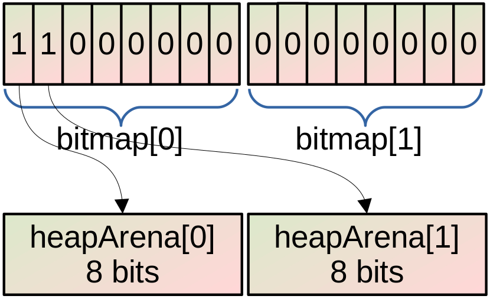
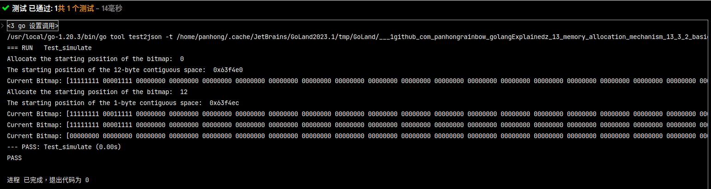

# Simulating Memory Management

## Introduction

Basic components are as follows:

|  Item  | Description                                                  |
| :----: | ------------------------------------------------------------ |
| Arena  | used to allocate objects from a contiguous region of memory. |
| Bitmap | used to keep track of which bytes in the arena are in use and which are free. |
|  Span  | used to manage memory allocation and deallocation.           |

## Simulation

The overall diagram of the simulation program is as follows:

 

The execution result of the simulation program is as follows:

The changes in the Bitmap can be observed as follows:

| Work                 | Bitmap Changes     |
| -------------------- | ------------------ |
| Allocate 12 bytes    | [11111111 00001111 |
| Allocate 1 more byte | [11111111 00011111 |
| Reclaim 1 byte       | [11111111 00001111 |
| Reclaim 1 more byte. | [00000000 00000000 |

