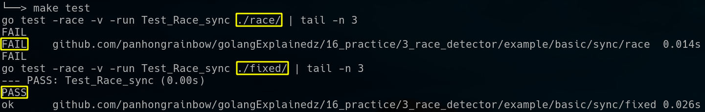

# Race Detector

> Here I list all the places where `race detector` is needed, including examples and instructions for actual operation.

## Introduction

If the code contains the following content, then consider using `race detecter`.

### Basic Rules

1. When `global variables` 、`Package-level variables` or `static variables` are shared among `multiple Goroutines`.

   ```bash
   $ cd /home/panhong/go/src/github.com/panhongrainbow/golangExplainedz/16_practice/3_race_detector/example/basic/goroutine
   $ make test
   ```

    

   ```bash
   $ cd /home/panhong/go/src/github.com/panhongrainbow/golangExplainedz/16_practice/3_race_detector/example/basic/goroutine
   $ make benchmark
   ```

    

2. As long as the program contains `channel`

   - Channels `do not` cause race conditions, but if there is `a malfunction in the channel mechanism`, there `may be` race conditions. (通道不会有 race，但机制故障就难说了)

   ```bash
   $ cd /home/panhong/go/src/github.com/panhongrainbow/golangExplainedz/16_practice/3_race_detector/example/basic/channel
   $ make test
   ```

    

3. As long as the program contains `syc package`

   - sync `does not` cause race conditions, but if there is `a malfunction in the sync mechanism`, there `may be` race conditions. (sync 不会有 race，但机制故障就难说了)

   ```bash
   $ cd /home/panhong/go/src/github.com/panhongrainbow/golangExplainedz/16_practice/3_race_detector/example/basic/sync
   $ make test
   ```

    

4. As long as the program contains `closure`
   ```bash
   $ cd /home/panhong/go/src/github.com/panhongrainbow/golangExplainedz/16_practice/3_race_detector/example/basic/closure
   $ make test
   ```

    

5. Reading and writing `map` or `configuration information` in multiple Goroutines
   ```bash
   $ cd /home/panhong/go/src/github.com/panhongrainbow/golangExplainedz/16_practice/3_race_detector/example/basic/map
   $ make test
   ```
   
    
   
   ```bash
   $ cd /home/panhong/go/src/github.com/panhongrainbow/golangExplainedz/16_practice/3_race_detector/example/basic/map
   $ make benchmark
   ```

    
   
7. As long as the program `accesses interface variables`

(2023/4/24)

## Instructions order

The CPU determines how the compiler and processor reorder instructions.

### CPU Memory Model:

[reference](https://go.dev/ref/mem)

its memory model as `Sequential Consistency` (not Relaxed), which means that in a concurrent environment, all CPUs must access memory in sequence and there is no reordering between them.

For example:
```go
a = 1   // Statement 1
b = 2   // Statement 2
x = b   // Statement 3 
y = a   // Statement 4
```

In `Sequential Consistency`, whether it's one CPU at different times or multiple CPUs at the same time, the order must be `1 -> 2 -> 3 -> 4`. It cannot be any other order.

```In the absence of data races, Go programs behave as if all the goroutines were multiplexed onto a single processor. This property is sometimes referred to as DRF-SC: data-race-free programs execute in a sequentially consistent manner. ``` [The Go Memory Model](https://go.dev/ref/mem)

I means as long as there are no data races, the behavior of Go routines will be the same as the main program.

### Memory Barrier

> Memory barriers only ensure `the order of instruction reordering`, but do `not prevent race conditions`.

#### Introduction

When the `compiler or CPU` may reorder instructions to improve performance, the `Go runtime` inserts `memory barriers` to prohibit specific types of reordering to achieve memory consistency.

#### Find memory barriers

##### Create an example

Create a new program that contains a channel

```bash
$ vim golangExplainedz/16_practice/3_race_detector/example/momory_barrier/channel/demo.go
```

```go
package main

import (
	"fmt"
	"time"
)

func main() {
	ch := make(chan int)

	go func() {
		fmt.Println("Sending value on channel")
		ch <- 42
	}()

	go func() {
		fmt.Println("Receiving value from channel")
		value := <-ch
		fmt.Println("Received value:", value)
	}()

	time.Sleep(time.Second)
}
```

compile the example

```bash
$ go build -o demo demo.go
```

##### Disassemble the example

```bash
$ objdump -d demo > asm.txt

$ vim asm.txt
```

```assembly
0000000000404920 <runtime.chansend>:
...
  4049d5:	e8 86 57 00 00       	callq  40a160 <runtime.lock2>
  // Lock the channel data structure and add memory barriers
...
  404ac8:	f0 45 0f b1 88 78 01 	lock cmpxchg %r9d,0x178(%r8)
  // Perform atomic compare-and-swap operations
```

##### Question 1

[Question] Why does `runtime.chansend` use memory barriers `so late`?

[Answer] At the beginning of the function, memory barriers are not used directly. 

runtime.chansend has some works for `channel state judgment, register saving, and control flow operations`.

When it is `decided that sending through a channel` is possible and important parts of the channel are used or changed, `memory barriers are put` in place.

If memory barriers are added at the beginning, it is inefficient and redundant.

(2023/4/20)

## Atomic

> Atomic operations are implemented at the hardware level and can be used to fix data races when multiple threads access and modify the same variable at the same time.
>
> [bug reference](https://pkg.go.dev/sync/atomic)

### Introduction

Atomic operations are implemented at the hardware level using special cache and memory coherency and bus synchronization protocols (channel and lock) .

These protocols ensure that atomic operations are executed in a thread-safe manner, without interference from other threads. 

### Atomic in CPU

#### Introduction

The atomic package is implemented using memory barriers.

#### Linux flags

Confirm if the Linux distribution supports golang atomic.

| cpu flags | descriptions                                 |
| --------- | -------------------------------------------- |
| cx8       | supports 8-byte atomic exchange instruction  |
| cx16      | supports 16-byte atomic exchange instruction |

```bash
$ cat /proc/cpuinfo
```

 

(2023/4/24)

#### Bug


On 386, the 64-bit functions use instructions unavailable before the Pentium MMX.


On non-Linux ARM, the 64-bit functions use instructions unavailable before the ARMv6k core.


On ARM, 386, and 32-bit MIPS, it is the caller's responsibility to arrange for 64-bit alignment of 64-bit words accessed atomically via the primitive atomic functions (types [Int64](https://pkg.go.dev/sync/atomic#Int64) and [Uint64](https://pkg.go.dev/sync/atomic#Uint64) are automatically aligned). The first word in an allocated struct, array, or slice; in a global variable; or in a local variable (because the subject of all atomic operations will escape to the heap) can be relied upon to be 64-bit aligned.

(2023/4/19)