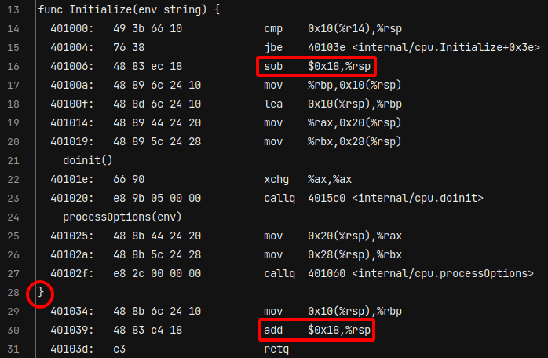
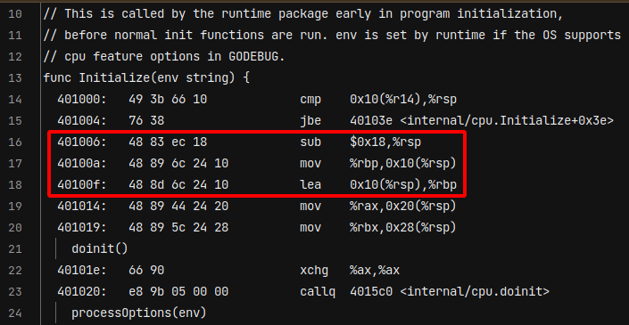
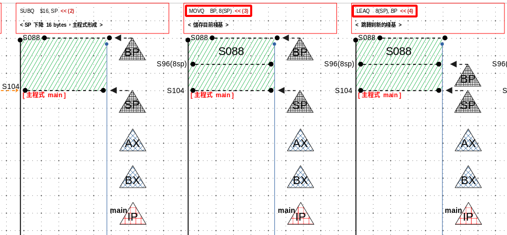

 

# Assembly

## The inaccuracy of disassembly

Look at a piece of disassembled content.

 

There are two lines that `expand` and `close the stack`, respectively.

```assembly
401006:	48 83 ec 18          	sub    $0x18,%rsp # This expands the stack
} # Function ends early
401039:	48 83 c4 18          	add    $0x18,%rsp # This closes the stack
```

The problem is that the stack `has not been closed yet`, how come it ends the function early. (为什么？为什么？在这里栈函数会提早结束)

`The possible reason` is that the disassembly is `incorrect`.

Based on the above disassembled content, I don't know if the line numbers `have been reordered` `or` if the disassembled content itself is `incorrect`.

`This is unclear.`


In addition, why is it said that the disassembled content is `not necessarily completely correct`.

There are two reasons for this view:

1. The general view is that because `optimization` will cause `some differences` between the disassembled content and the original code, but I don't think this can be said to be incorrect.
   (`I cannot accept this view.`)
2. Another view is that the disassembled content will `skip an entire block of 0 values`.
   If the `original code itself contains an entire block of 0 values`, then the disassembled content must be incorrect.
   
   (The link is invalid, just use it as a reference) 


It can only be said that the disassembled content is `a very good reference`, but it `cannot` be said to be completely correct.

(2023/5/19)

## Compare lea and mov

In fact, these three lines are just going through the process of `function jumping`.

 

```assembly
401006:	48 83 ec 18          	sub    $0x18,%rsp
40100a:	48 89 6c 24 10       	mov    %rbp,0x10(%rsp)
40100f:	48 8d 6c 24 10       	lea    0x10(%rsp),%rbp
```

Observe the difference between lea and mov instructions.



`lea` operates on `memory`, `mov` operates on `values`.

## Assembly language units

In fact, instructions such as `lea and mov` can be added with units, such as `leaq and movq`.

| Units | Description |  Size   |
| :---: | :---------: | :-----: |
|   b   |    byte     | 1 Byte  |
|   w   |    word     | 2 Bytes |
|   l   |    long     | 4 Bytes |
|   q   |  quadword   | 8 Bytes |

## NOP

`NOP instructions` are used to `adjust the size of a code fragment`, as `a placeholder for future instructions`, to `delay execution of other instructions`, for `debugging, testing`, and to `give other hardware devices time to respond`.

Here is an example in Go:

```go
go
package main

func main() {
  // Do something
  fmt.Println("Hello, world!")
  // Do nothing - this is effectively a NOP instruction
  _ = 1  
  // Do something else
  fmt.Println("Goodbye, world!")
}
```

## Memory Barriers

> When there is `mfence`, why do we need `xchg %ax,%ax` ?
>
> - `xchg  %ax,%ax` and `mfence` are different.
> - `xchg  %ax,%ax` is just a temporary exchange, while `mfence` is more forced.  (mfence 较强制)

Compare as follows:

| memory barrier | Description                                                  |
| -------------- | ------------------------------------------------------------ |
| xchg  %ax,%ax  | (1) `xchg  %ax,%ax` performs an `atomic read-modify-write operation` that requires ordering on `the memory bus`, acts as a memory barrier.<br/><br />(2) `xchg %ax,%ax` just occupies the memory bus, `preventing other instructions from executing`. bus 暂用时，其他指令就无法执行<br /><br />(3) That's just temporary, temporary, temporary. |
| mfence         | (1) mfence is very forced.<br />`A ll previous instructions must be completed` before continuing with subsequent instructions.<br />This means forcibly stopping and completing all instructions before mfence.<br />(mfence 之前的指令都要先完成)<br /><br />(2) Then how to know that the instructions before mfence have all been completed, because `the CPUs will notify each other`. <br />(因为 CPU 之间会互相通知) |

(2023/6/11)

## Handwrite Assembly 

> begin practicing writing assembly language

Here are the current implementation examples

| folder name | description                         |
| ----------- | ----------------------------------- |
| first       | The first assembly language program |
| etc         |                                     |

### first

```assembly
TEXT ·Add(SB), $0-16
    MOVQ a+0(FP), AX
    MOVQ b+8(FP), CX
    ADDQ CX, AX
    MOVQ AX, b+16(FP)
    RET
```

- **16** here refers to **the parameter size**.
  In this version, the entire program **does not use its own stack** (这次程式不使用自己的栈体).
- Instead of using SP (Stack Pointer), **this time FP (Frame Pointer)** is used. FP is used to access the parameter values, while SP is used to locate stack variables.
- **0(FP)** represents the location of **the first parameter relative to FP**, and **8(FP)** represents the location of **the second parameter**.
  The parameters are arranged in **reverse order**, which is convenient for subfuctions. (反向排列)
- The reason for storing the result at **16(FP)** is as follows:
  Using **0(FP)** would go beyond the storage for **main(IP)**,
  then it would reach the memory location of **the first parameter a 0(FP)**,
  then to the memory location of **the second parameter b 8(FP)**,
  and finally to reach **the return value** of the main program **16(FP)**.
  (就是主函数那会有准一个一个空间放回传值，这属于主函数的，指到 16(FP) 就可存取这个位置)

|---------------------------------------------|**(24FP)**

|     **the return value of the main program**

|---------------------------------------------|**(16FP)**

|     **b parameter**

|---------------------------------------------|**(8FP)**

|     **a parameter**

|---------------------------------------------|**(0FP)**

|     **main IP**

|---------------------------------------------|**(0SP)**

|     **add sub funciont (no stack)**

-----/
